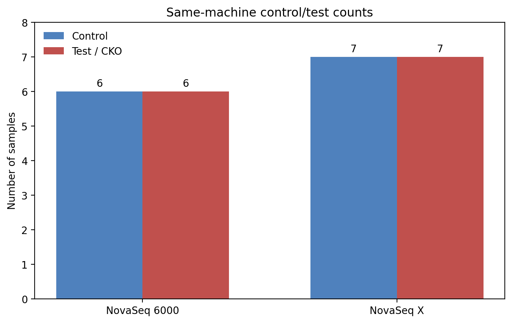

# DE group handoff validation — same-machine control/test structure

## Purpose

This is a short group handoff note confirming that the current mouse dataset still has enough same-machine control/test structure to proceed with the DE workflow already set up.

The detailed dataset tables and workflow resources are here:

- Notebook preview: https://github.com/pzg8794/mouse_group_project_work/blob/main/notebooks/mouse_differential_expression_team_walkthrough.ipynb
- DE handoff doc: https://github.com/pzg8794/mouse_group_project_work/blob/main/docs/MOUSE_DESEQ2_ANALYSIS_HANDOFF.md
- Shared environment guide: https://github.com/pzg8794/mouse_group_project_work/blob/main/docs/DESEQ2_SHARED_TEAM_GUIDE.md
- DE design table: https://github.com/pzg8794/mouse_group_project_work/blob/main/data/differential_expression_all26/tables/mouse_de_design_table.tsv
- Family manifest: https://github.com/pzg8794/mouse_group_project_work/blob/main/data/differential_expression_all26/tables/family_manifest.tsv
- Contrast manifest: https://github.com/pzg8794/mouse_group_project_work/blob/main/data/differential_expression_all26/tables/contrast_manifest.tsv

## Machine-level confirmation table

| Machine | Valid family context | Control | Test / CKO | Notes |
|---|---|---:|---:|---|
| `NovaSeq 6000` | `family_tissue_novaseq6000` | 6 | 6 | Strongest same-machine DE structure |
| `NovaSeq X` | `family_neurons_novaseqx` + `family_tissue_sham_novaseqx` | 7 | 7 | Valid same-machine structure across the two `NovaSeq X` families |

## Family-level breakdown

| Family | Machine | Control | Test / CKO |
|---|---|---:|---:|
| `family_tissue_novaseq6000` | `NovaSeq 6000` | 6 | 6 |
| `family_neurons_novaseqx` | `NovaSeq X` | 3 | 3 |
| `family_tissue_sham_novaseqx` | `NovaSeq X` | 4 | 4 |

## Confirmation plot



```text
NovaSeq 6000  | control: 6 | test: 6
NovaSeq X     | control: 7 | test: 7
```

## Group takeaway

Yes — the current dataset does contain same-machine control/test structure.

That means the project can continue with the family-specific DE strategy already implemented. The invalid part is the direct cross-machine comparison, not the use of the current dataset itself.
